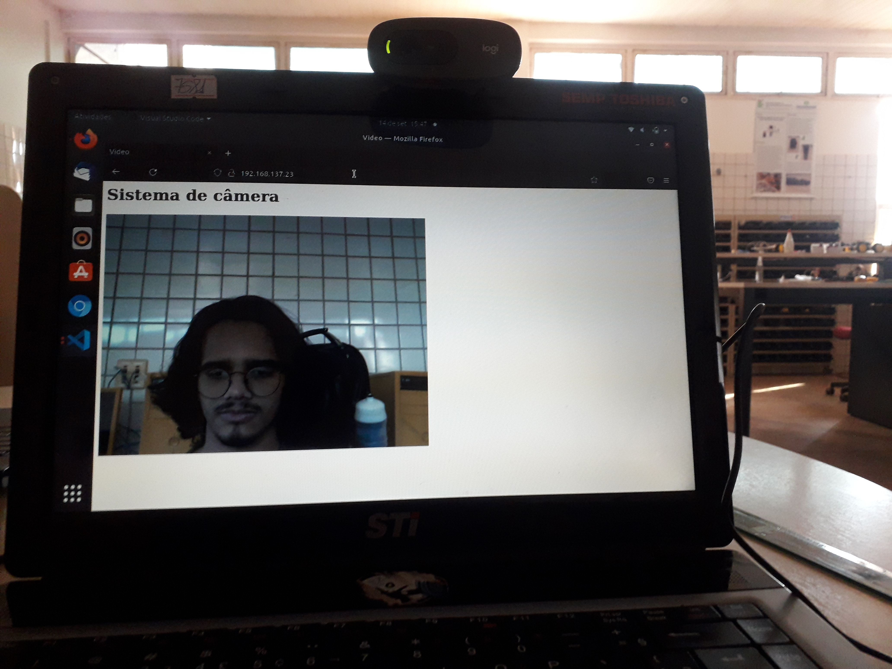

<h1> Sistema de câmera web </h1>

<h2> Sobre o Sistema </h2>

Software de câmera via web utilizando o Framework *Flask*, com auxilio de uma câmera *USB* (Também é possivel usar a propria webcam do PC).

# 🛠️ Abrir e rodar o projeto


Primeiramente Teremos que Clonar o Repositorio no **Terminal** ou em uma **IDL** de sua Preferencia
```
git clone https://github.com/Wenderson-Oscar/camera_web.git
```
Agora você deve ter uma estrutra de diretório parecida com isso:


Para podermos continuar teremos que criar um ambiente virtual
```
virtualenv env
```
Caso não tenha um ambiente virtual Criaremos um com o Comando a seguir
```
pip install virtualenv
```
Depois execute o **Comando Anterior**

Ativando o Ambiente Virtual
```
. env/bin/activate
```

Depois Teremos que baixar as devidas dependencias 
```
pip install -r requirements.txt
```
Executando o projeto

```
python camera.py
```

<h3> Exemplo do Projeto em execução: </h3>


<h4> Câmera USB: </h4>


Caso Queira Desativar o Ambiente Virtual Use o Comando 
```
deactivate
```
